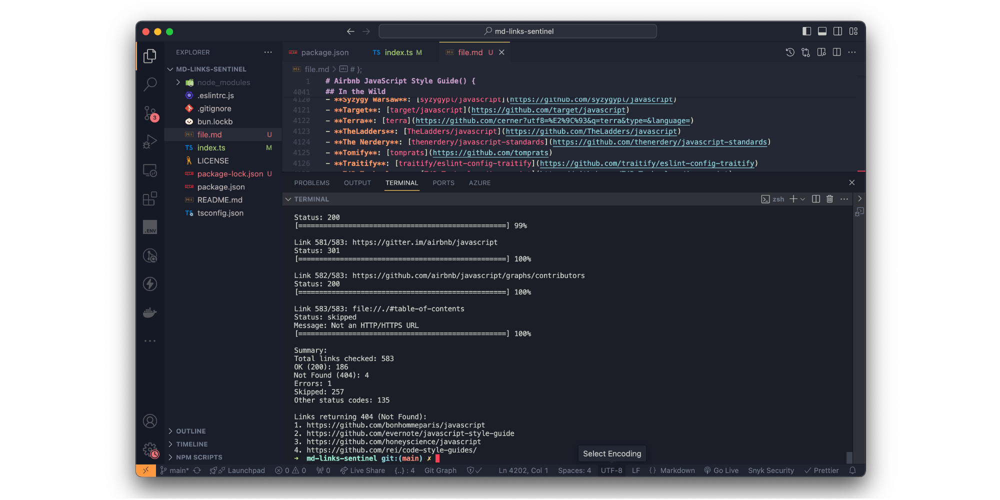

# md-links-sentinel

md-links-sentinel is a TypeScript-based utility for validating hyperlinks in Markdown files. It extracts URLs, performs HTTP/HTTPS requests, and reports link statuses. The tool provides a console interface with progress tracking, detailed logging, and result summaries, categorizing links by HTTP status codes with emphasis on 404 errors.



It's designed for efficient documentation maintenance, finding dead-link, and link integrity verification.

## Name Etymology

- **"md"** : Abbreviation for Markdown, indicating the file type this tool processes.
- **"link"**: Specifies the tool's primary function - link checking.
- **"sentinel"**: Implies vigilance and monitoring, which is exactly what this tool is doing. It watches over links and reports their status.

To install dependencies:

```bash
bun install
```

To run:

```bash
bun run index.ts
```

This project was created using `bun init` in bun v1.1.8. [Bun](https://bun.sh) is a fast all-in-one JavaScript runtime.
